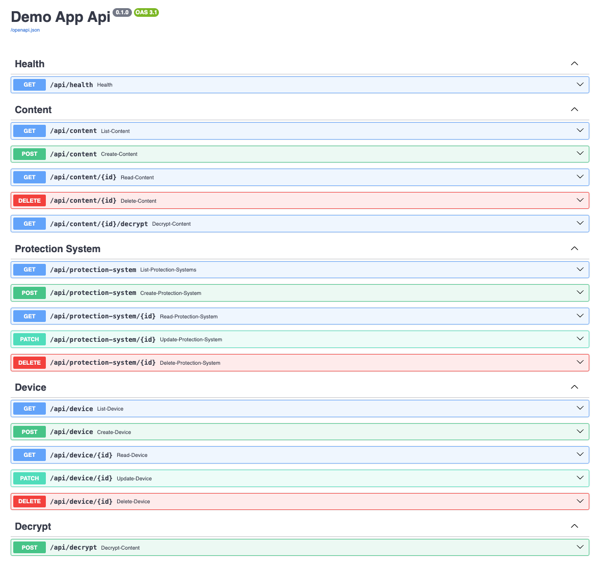

[](https://github.com/FedirAlifirenko/fastapi-app-demo/actions/workflows/ci.yml)

# Example API with a Persistence Layer
## Description

This project showcases an API implementation with a persistence layer, serving as a reference for building scalable and maintainable APIs using modern Python backend technologies and best practices.

### **Technologies Used**
- **Web App Layer:** FastAPI  
- **Persistence Layer:** SQLAlchemy, PostgreSQL  
- **Deployment:** Docker Compose  
- **Database Migrations:** Alembic  
- **Testing:** Pytest  
- **Code Formatting & Linting:** Black, Isort, Flake8, Mypy  
- **Task Automation:** Poetry + Taskipy  

### **Project Structure**
- **`./app`:** Main application package  
  - **`./api`:** FastAPI routers and request/response models  
  - **`./app/db`:** SQLAlchemy models, database session management, and CRUD operations (`SqlAlchemyRepository`)  
  - **`./app/services`:** Business logic  
- **`./tests`:** Test suite  
- **`./migrations`:** Alembic migrations  

### **API Endpoints**



## Development
### Installation
#### Install python3.12 virtual environment and activate it
```commandline
python3.12 -m venv .venv
source .venv/bin/activate
```
#### Install Poetry in the previously created virtual environment
```commandline
pip install poetry
```
#### Install project using poetry
```commandline
poetry config virtualenvs.create false
poetry install --with dev
```
#### Prepare .env file
Use the provided `.env.example` file to create a `.env` file with the necessary environment variables.

### Testing
#### Locally
Run lint checks
```commandline
poetry run task lint
```
Run tests (ensure that db is running `docker compose up -d db db-migrate`)
```commandline
poetry run task test
```

#### Docker
Run tests in docker
```commandline
docker compose run --rm test
```


### Running
Run everything in docker
```commandline
docker compose up
```
Open [http://localhost:8000/docs](http://localhost:8000/docs) in your browser to see the API documentation.

## TODO
### Functional
- [ ] Support other encryption modes 

### Non-functional
- [x] Measuring test coverage
- [ ] Cover all administration endpoints with tests
- [ ] Pagination for the list routes
- [ ] Timestamp fields for the models (created_at, updated_at)
